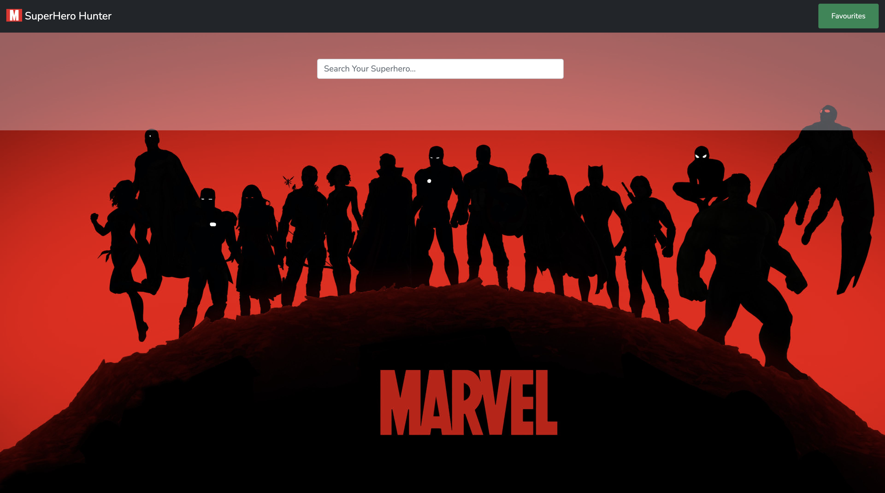

# SuperHero Hunter
Welcome to the Superhero Hunter project! This project is designed to allow users to search for and explore information about their favorite superheroes.

# Overview
Superhero Hunter is a web application that utilizes the Superhero API to fetch data about various superheroes. Users can search for superheroes by name and view details such as their biography, appearance, powers, and more.

# Features
1. Search: Users can search for superheroes by entering their name in the search bar.
2. View Details: Once a superhero is found, users can view detailed information about them, including their biography, appearance, powers, and connections.
3. Favorite Superheroes: Users can mark their favorite superheroes and access them later for quick reference.

# Technologies Used
1.HTML
2.CSS
3.JavaScript
4.Superhero API

# Getting Started
To run the project locally, follow these steps:
1.Clone this repository: git clone https://github.com/vishakha161996/superhero-hunter.git
2.Navigate to the project directory.
3.Open index.html in your web browser.

# How to Use
1.Open the Superhero Hunter web application.
2.Enter the name of the superhero you want to search for in the search bar.
3.Press the "Search" button.
4.View detailed information about the superhero.
Optionally, mark the superhero as a favorite by clicking on the "Add to Favourite" button.

# Credits
This project utilizes the Superhero API, which provides access to a vast database of superhero information.

# Contributing
Contributions are welcome! If you'd like to contribute to this project, please fork the repository and submit a pull request with your changes.

# License
This project is licensed under the MIT License - see the LICENSE file for details.

# Contact Information

Feel free to reach out to me via email at panwarvishakha31@gmail.com or connect with me on LinkedIn https://www.linkedin.com/in/vishakha-panwar-55a84114b/. I'm open to collaborations, job opportunities, or just a friendly chat!

Thank you!